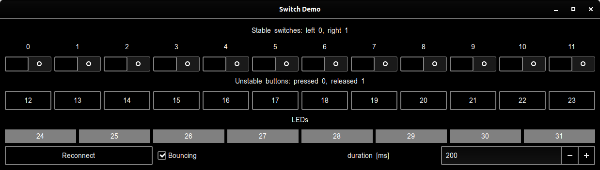

# Buildroot and GPIO

### Linux in Embedded Systems

### Project Requirements

The requirements are as follows:

1. Prepare an application in C language, which uses the buttons and LED diodes. When reading the buttons, please take into consideration the "contact bounce" effect. The application should use the new "libpiod" based handling of GPIOs

2. It is required that application implements thorough error checking (you can’t assume that e.g. all hardware communication functions always succeed).

3. The application must respond to changes of state of the buttons without active waiting (should sleep waiting for the required change)

4. It is important that the functionality is sensitive to "bounce effect".

5. The application should be converted into the Buildroot package.

6. Please try debugging your application with the gdb debugger.

### Project Tools

The project utilizes the following tools:

* Buildroot 2020.02
* Configuration based on following [distribution](https://github.com/wzab/BR_Internet_Radio/tree/gpio/QemuVexpressA9)
* C programming language
* `libgpiod` C API
* Python 3.7
* Virtualenv

## Project Distribution and Installation

### Initial setup

In the case of using the repository (and not directly downloading the buildroot package) the project may be setup using the `build.sh` script.

The script will:

1. Download buildroot 2020.02
2. Unpack it
3. Move required configuration files
4. Apply patches to the configuration
5. Build the linux image

To access the image configuration one may use (in the buildroot directory) 

``` sh
$ make menuconfig
```

To access the linux image one may use the prepared script, but the following steps must be made first:

1. Create a virutal environment for python3 (name it `.venv` )
2. Install the pip packages listed in `requirements.txt` 

Once these steps are complete, one may use the following to run the linux image

``` sh
$ ./runme
```

The runme completes the following:
1. Opens the GUI
2. Updates the image to the latest configuration
3. Opens the image
4. Upon closing the image, closes the GUI

Access credentials: `root` 

### C application

The C application is stored in `overlay/root/mod.c` . The binary is prepared in the repository, but in case of modification or corruption it may be recompiled. In this case, the following steps should be completed:

1. In the buildroot directory execute

``` sh
$ export BRPATH= `pwd` 
```

2. In the `overlay/root` directory execute

``` sh
$ ./build
```

The custom build script will finalize the required setup to compile the C application.

### Python GUI

The python GUI for this project has been sourced from the repository mentioned above. It uses posix queues to communicate with the linux image. Beyond creating the virtual environment, no setup is required. It is accessed by `GUI/gui2.py` .

## Project overview

### Math game

The project uses the `libgpiod` library to communicate with the GUI. The C application uses the connection to simulate a math game.

The project uses the following GUI:



The game is rather simple - at random each of the 8 led diodes will be "activated". With the help of the buttons and switches, the user must create a sum of numbers equal to the sum of numbers represented by the activated led diodes. The user uses buttons to add the values of the buttons to their sum. The switches are used to indicate if this value is positive (addition) or negative (subtraction).

At the end of each round, the diodes flash to represent winning the round.

The application has standard error-checking implemented and uses signal handling to allow safe exits with Ctrl-C (SIGINT).

The detailed application methodology is explained within the code comments.

To play the game one should executethe following commands within the root (default) directory on the buildroot image.

``` sh
$ ./mod
```

or 

``` sh
./mod 2>/dev/null
```

to disable debug printing.

### Project setup

The following steps were taken to setup the project.

1. Copy the repository (QemuVexpressA9) from the following [repository](https://github.com/wzab/BR_Internet_Radio/tree/gpio)
2. Create virutal environment to use GUI
3. Create Makefile and build script  
4. Create test C application in overlay subdirectory
5. Test C application in image
6. Repeat step 5 until satisfactory
7. Test with `gdb debugger`
